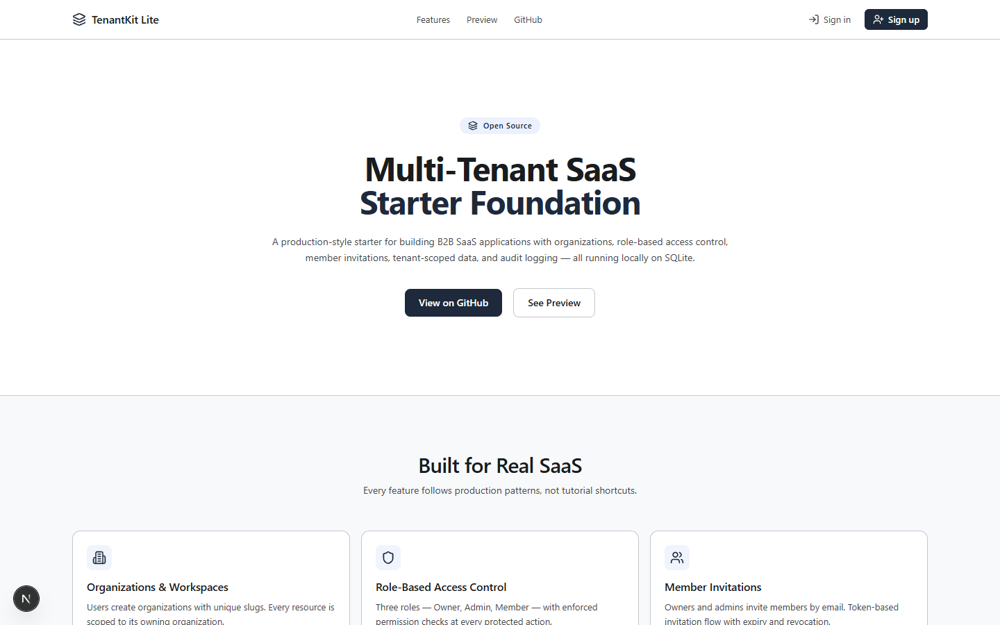
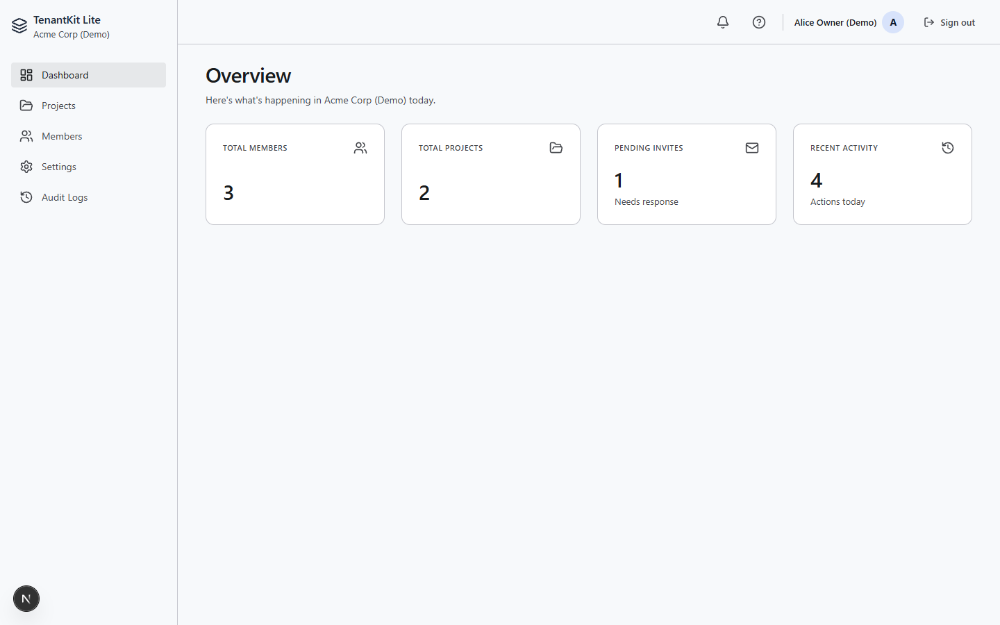
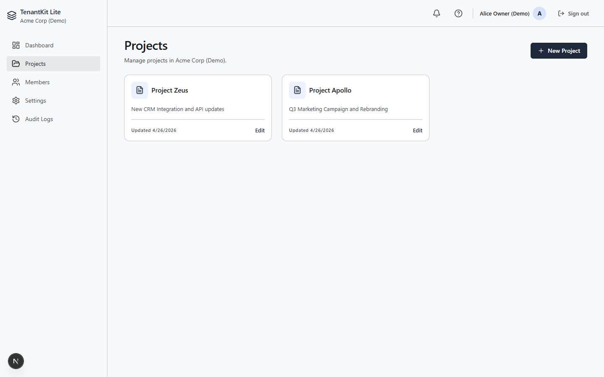
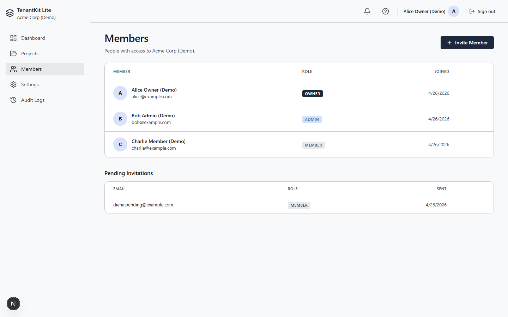
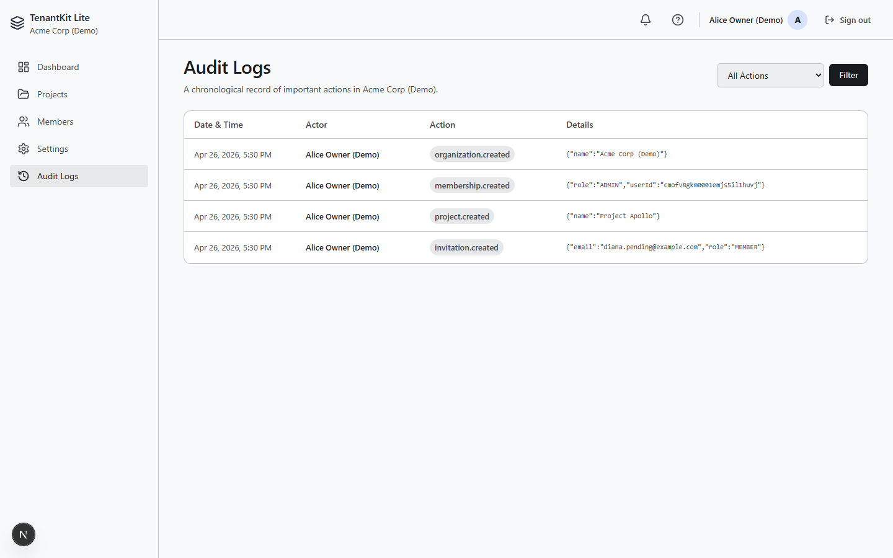

# TenantKit Lite

[](https://github.com/Thaelith/TenantKit-Lite/actions)


A production-style multi-tenant SaaS starter built with Next.js, TypeScript, SQLite, Prisma, and robust Role-Based Access Control (RBAC).

## Why This Project Exists

Many Next.js starter kits provide basic CRUD functionality but fail to address the complex requirements of true B2B SaaS applications. TenantKit Lite was built to demonstrate how to implement fundamental enterprise features—like hard tenant isolation, strict role-based access control, invitation workflows, and immutable audit logging—while keeping local development incredibly simple. It uses a file-based SQLite database so developers can clone, run, and learn without needing Docker or PostgreSQL.

## What This Demonstrates

This repository serves as a portfolio piece showcasing:
- **Security-First Design:** Structurally preventing Insecure Direct Object Reference (IDOR) attacks through query-level tenant isolation.
- **Enterprise Capabilities:** Real-world implementations of RBAC and Audit Logging.
- **Modern React Patterns:** Extensive use of Next.js App Router, Server Components, and Server Actions.
- **Clean Architecture:** Keeping business logic testable and separated from UI components.

## Features

- **Email/Password Authentication** — Register and login securely with bcryptjs password hashing via Auth.js.
- **Auto-Workspace Creation** — New sign-ups automatically receive a default organization and the `OWNER` role.
- **Multi-Tenant Architecture** — Isolated organizations and workspaces with unique slugs.
- **Role-Based Access Control (RBAC)** — Strictly enforced `OWNER`, `ADMIN`, and `MEMBER` roles.
- **Member Invitations** — Secure token-based invitation flow to add new members to workspaces.
- **Tenant-Scoped Resources** — Queries are strictly scoped by `organizationId` to prevent cross-tenant data leaks.
- **Audit Logging** — Automatic tracking of organization events (actor, action, entity, metadata).
- **SQLite + Prisma** — Zero-dependency local database for instant setup.
- **Fully Tested** — Unit tests cover critical security, isolation, and RBAC logic using Vitest.
- **Automated CI** — GitHub Actions workflow ensures lint, build, and tests pass on every pull request.

## Demo & Seed Data

You can quickly populate the database with realistic demo data, including users with different roles, projects, and audit logs.

```bash
npm run seed
```

**Demo Credentials (all passwords are `demo123`):**
- Owner: `alice@example.com` (Full access)
- Admin: `bob@example.com` (Cannot access settings or delete org)
- Member: `charlie@example.com` (Can only view/edit projects)

> **Troubleshooting Note:** If running `npm run seed` or manually deleting the local database causes a "No organization access" or loop behavior, it means your browser has a stale session cookie for a user that no longer exists in the database. Simply click "Sign out" on the main landing page, or clear your localhost cookies, and log in with the new credentials.

For a guided 5-minute walkthrough, see the [Demo Script](docs/demo-script.md).

## Screenshots

### Landing Page


### Dashboard Overview


### Projects


### Members


### Audit Logs


## Tech Stack

| Technology | Purpose |
|---|---|
| [Next.js 15](https://nextjs.org) | App Router, server components, API routes |
| [TypeScript](https://www.typescriptlang.org) | Type safety and autocompletion |
| [Tailwind CSS](https://tailwindcss.com) | Utility-first, responsive styling |
| [Prisma](https://www.prisma.io) | ORM with strongly-typed queries |
| [SQLite](https://www.sqlite.org) | Local-first, file-based database |
| [Auth.js](https://authjs.dev) | Authentication (NextAuth v4) |
| [Zod](https://zod.dev) | Input and API schema validation |
| [Lucide React](https://lucide.dev) | SVG icon library |
| [Vitest](https://vitest.dev) | Blazing fast unit testing framework |

## Architecture Overview

```text
Browser
  ↓
Next.js App Router (React Server Components)
  ↓
Auth.js Session (Validates User Token)
  ↓
Permission Layer (Role + Membership Checks)
  ↓
Prisma ORM (Tenant-Scoped Queries)
  ↓
SQLite (file:./dev.db)
```

## Database Schema Overview

```text
User ──┬── Account (OAuth providers)
       ├── Session (auth tokens)
       └── Membership (Roles: OWNER, ADMIN, MEMBER)
             │
        Organization ──┬── Project
                       ├── Invitation
                       └── AuditLog
```

The schema is built around six core models: `User`, `Organization`, `Membership`, `Invitation`, `Project`, and `AuditLog`.

## Tenant Isolation Notes

Every protected resource is strictly scoped by `organizationId`. Queries never rely on route parameters alone — they always verify the current user's membership and permissions in the target organization.

```ts
// Bad — No tenant scope (Vulnerable to IDOR)
await prisma.project.findUnique({ where: { id: projectId } });

// Good — Strictly scoped by organization
await prisma.project.findFirst({
  where: { id: projectId, organizationId },
});
```

## Invitation Workflow

1. An `OWNER` or `ADMIN` generates an invitation link in the dashboard.
2. An `Invitation` record is created in the database with a secure, expiring token.
3. The recipient opens the link (`/invite/[token]`).
4. If they do not have an account, they are prompted to register.
5. Upon acceptance, a `Membership` record is created linking them to the organization, and the invitation is consumed.

## Audit Logging

Critical actions (creating projects, editing resources, inviting members) are tracked. Audit logs capture the `actorId` (who did it), the `action` (what they did), the `entityId` (what was affected), and any relevant JSON metadata. This provides a transparent history for organization administrators.

## Testing & CI

TenantKit Lite prioritizes logic validation over brittle UI tests. Essential business logic covering tenant isolation, role barriers, token expirations, and audit integrations are heavily tested using Vitest.

- **Run tests locally:** `npm test` or `npm run test:watch`
- **Continuous Integration:** GitHub Actions automatically runs linting, type-checking, builds, and unit tests on pushes and pull requests to `main`.

## Local Setup

### Prerequisites
- Node.js 20.9+ (Recommended for Next.js 15)
- npm 9+

### Installation

```bash
# Clone the repository
git clone https://github.com/Thaelith/TenantKit-Lite.git
cd TenantKit-Lite

# Install dependencies
npm install

# Copy environment variables
cp .env.example .env

# Generate a secure NEXTAUTH_SECRET (or use the default for dev)
node -e "console.log(require('crypto').randomBytes(32).toString('hex'))"

# Run Prisma migrations to initialize the SQLite database
npx prisma migrate dev --name init

# Start the development server
npm run dev
```

Open [http://localhost:3000](http://localhost:3000) to see the application.

## Environment Variables

| Variable | Description | Default |
|---|---|---|
| `DATABASE_URL` | SQLite database file path | `file:./dev.db` |
| `NEXTAUTH_SECRET` | Auth.js JWT encryption secret | *(must be provided)* |
| `NEXTAUTH_URL` | Application base URL | `http://localhost:3000` |

## Manual QA Checklist

Before deploying or finalizing major features, refer to the [Manual QA Checklist](docs/manual-qa.md) located in the `docs/` folder to verify system integrity.

## Roadmap

| Phase | Milestone | Status |
|---|---|---|
| 1 | Project foundation, Prisma schema, landing page | Complete |
| 2 | Authentication (Auth.js, login, register, auto-workspace) | Complete |
| 3 | Organization dashboard, settings, members | Complete |
| 4 | Tenant-scoped project CRUD | Complete |
| 5 | Role-based access control enforcement | Complete |
| 6 | Member invitation workflow | Complete |
| 7 | Audit logging | Complete |
| 8 | Testing (Vitest, validation logic) | Complete |
| 9 | CI & GitHub portfolio polish | Complete |
| 10 | Portfolio readiness, seed data, screenshots, docs | Complete |

## Security

Please see [SECURITY.md](SECURITY.md) for vulnerability reporting and architecture principles.

## Contributing

Please see [CONTRIBUTING.md](CONTRIBUTING.md) for guidelines on how to contribute.

## License

[MIT License](LICENSE)